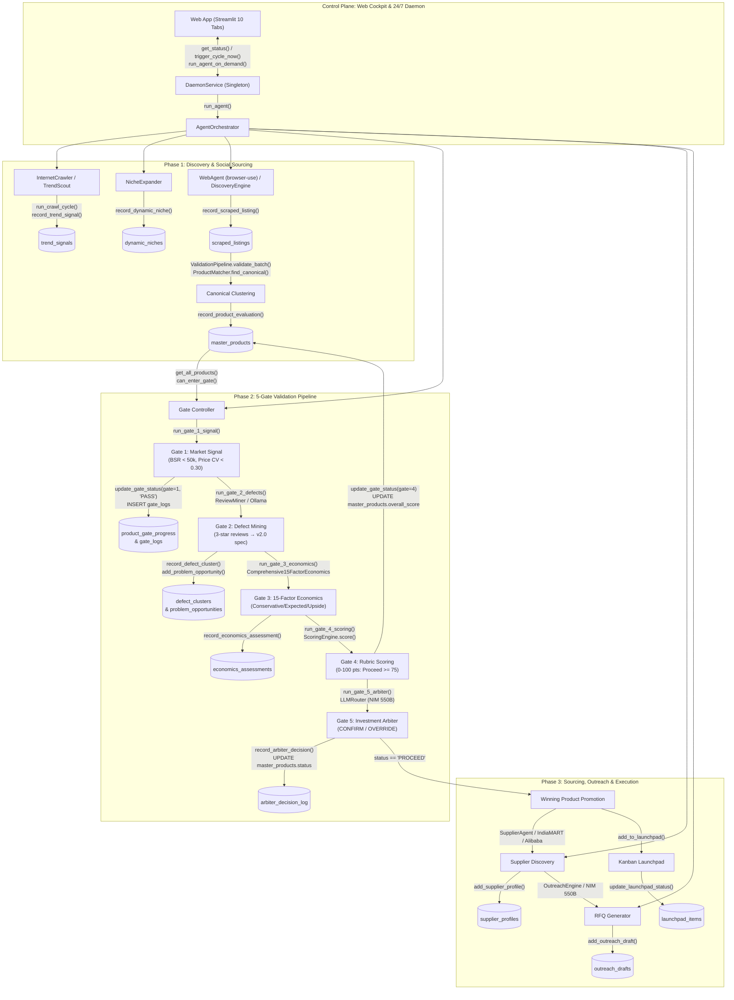

# APRS V7 Pro: Complete Architectural Flow, Data Lineage & System Map

> Generated from Graphify Knowledge Graph analysis (2,596 nodes, 5,062 edges, 169 community subsystems) and deep codebase audit of `D:\ecomm-strategy`.

---

## Executive Summary & Graphify Knowledge Graph Metrics

- **Core APRS Modules Analyzed**: 108 Python modules across `core/`, `tools/`, `integrations/`, `config/`, and `web/` (excluding third-party submodule `tools/browser-use/`).
- **Knowledge Graph Topology**: **2,596 total nodes** and **5,062 directed edges**.
- **Community Subsystems**: **169 functional clusters** identified by Louvain/Leiden modularity clustering.
- **Interactive Visualization Artifact**: Generated at [`graphify-out/graph.html`](graphify-out/graph.html) (2.38 MB standalone visual explorer).
- **Audit Log**: Generated at [`graphify-out/GRAPH_REPORT.md`](graphify-out/GRAPH_REPORT.md).

### Top "God Nodes" (Highest Network Centrality)
These components represent the primary hubs of the entire system architecture:
1. **`core.database.get_connection()`** (Degree: **166**): The single source of truth (SSOT) SQLite connection provider with WAL mode.
2. **`core.agent_orchestrator.AgentOrchestrator`** (Degree: **65**): The master multi-agent coordinator executing the 15-stage research pipeline.
3. **`core.validation.RawProduct` / `CanonicalProduct`** (Degree: **57** each): Pydantic v2 schemas enforcing strict ingestion contracts and entity deduplication.
4. **`core.llm_router.LLMRouter`** (Degree: **53**): 5-tier intelligent fallback router (NIM 550B → Ollama Local → Groq Free → Kimi-K3 Local → Human Fallback).
5. **`integrations.evolution_go.EvolutionGoClient`** (Degree: **50**): WhatsApp Business API automated supplier outreach client.
6. **`core.gate_engine.GateEngine`** (Degree: **46**): Sequential 5-gate mathematical and AI validation engine.
7. **`tools.web_agent.WebAgent`** (Degree: **38**): Autonomous browser-use agent for smart dynamic DOM interaction and scraping.
8. **`core.economics_engine.Comprehensive15FactorEconomics`** (Degree: **37**): 15-Factor 3-Scenario unit economics waterfall model.

---

## 1. Complete Architectural Flow & Database Connections

### System Flowchart (Mermaid)

### End-to-End Data Lineage & Database Operations

1. **Step 1: Trend Discovery & Ingestion**
   - **Agent/Module**: `tools/internet_crawler.py` & `tools/trend_scout/trend_aggregator.py`
   - **Logic**: Continuously fetches trend signals from Google Trends, Reddit, Instagram, and web RSS feeds.
   - **Database Writes**:
     - `core.database.record_trend_signal(platform, keyword, category, region, velocity_score, longevity_type)` → writes to `trend_signals`.
     - `core.database.record_dynamic_niche(category, region, search_limit)` → writes to `dynamic_niches`.
     - `core.database.record_seed_keyword(keyword, region)` → writes to `seed_keywords`.

2. **Step 2: Multi-Marketplace Scraping & Canonical Normalization**
   - **Agent/Module**: `tools/web_agent.py` (`browser-use`), `tools/discovery_engine.py`, `core/validation.py`
   - **Logic**: Navigates Amazon India, Flipkart, and Meesho via autonomous headless browser. Gathers raw titles, prices, ratings, BSRs, and listing URLs.
   - **Database Writes**:
     - `core.database.record_scraped_listing(config_id, listing_dict)` → writes to `scraped_listings`.
     - `core.database.record_multi_platform_listing(product_id, platform, title, price, url)` → writes to `multi_platform_listings`.
     - `core.validation.ValidationPipeline.validate_batch()` validates against `RawProduct`.
     - `core.validation.ProductMatcher.find_canonical()` clusters duplicates across marketplaces into `CanonicalProduct`.
     - `core.database.record_product_evaluation()` → upserts into `master_products`.

3. **Step 3: 5-Gate Sequential State Machine**
   - **Gate 1 (Market Signal Validation)**:
     - Calls `GateEngine.run_gate_1_signal()`.
     - Validates: Amazon BSR < 50,000, Price Stability CV < 0.30.
     - Writes: `update_gate_status(pid, gate=1, status='PASS')` in `product_gate_progress` & logs to `gate_logs`.
   - **Gate 2 (3-Star Defect & Problem Mining)**:
     - Calls `GateEngine.run_gate_2_defects()` via `ReviewMiner` (local Ollama `qwen3:latest` / Groq / NIM).
     - Identifies actionable failure modes, root causes, and v2.0 engineering upgrade specifications.
     - Writes: `record_defect_cluster()` into `defect_clusters` and `add_problem_opportunity()` into `problem_opportunities`.
   - **Gate 3 (15-Factor 3-Scenario Economics Waterfall)**:
     - Calls `GateEngine.run_gate_3_economics()` via `Comprehensive15FactorEconomics`.
     - Computes Conservative, Expected, and Upside unit economics incorporating: FOB, Packaging, Volumetric Freight, Marketplace Referral & Closing Fees, FBA Pick/Pack, Payment/COD Gateway (60% COD split), RTO Returns Reserve (12-28%), Return Fraud Buffer, Tacos Ad Spend, Damage Reserve, Tooling Amortization, and Net GST Burden with 85% Input Tax Credit.
     - Writes: `record_economics_assessment()` for all 3 scenarios into `economics_assessments`.
   - **Gate 4 (Deterministic Rubric Scoring)**:
     - Calls `GateEngine.run_gate_4_scoring()` via `ScoringEngine.score()`.
     - Computes 0–100 composite score: Market Signal (25 pts), Review Quality (20 pts), Margin Safety (40 pts), Defect Fixability (10 pts), Competition Density (5 pts).
     - Minimum thresholds: `PROCEED` (>= 75), `MARGINAL` (60–74), `REJECT` (< 60).
     - Writes: `update_gate_status(pid, gate=4)` and updates `master_products.overall_score`.
   - **Gate 5 (NIM 550B Investment Arbiter)**:
     - Calls `GateEngine.run_gate_5_arbiter()` routing to NIM 550B via `LLMRouter`.
     - Evaluates full multi-gate dossier; outputs `CONFIRM`, `OVERRIDE_PROCEED`, or `OVERRIDE_REJECT`.
     - Writes: Logged to `arbiter_decision_log` and updates `master_products.status = 'PROCEED'`.

4. **Step 4: Sourcing, Outreach & Launchpad**
   - **Agent/Module**: `tools/supplier_agent.py`, `core/outreach_engine.py`, `core/product_pipeline.py`
   - **Logic**: For products reaching `PROCEED`:
     - Discovers direct manufacturers in Indian industrial clusters (Surat, Morbi, Tirupur, Noida, Ludhiana) or China (Shenzhen, Yiwu) via IndiaMART / Alibaba.
     - Writes: `add_supplier_profile()` into `supplier_profiles`.
     - Generates customized RFQ negotiation drafts specifying v2.0 engineering requirements and AQL 2.5 quality standards.
     - Writes: `add_outreach_draft()` into `outreach_drafts`.
     - Adds SKU to Kanban launchpad.
     - Writes: `add_to_launchpad()` into `launchpad_items`.

---

## 2. Web UI Button-to-Work Activation Matrix

Every button across all 10 tabs of [`web/app.py`](web/app.py) is cataloged with its exact code location, execution pathway, and database impact:

| Location / Tab | Button Label | App Line | Backend Function Triggered | Target Database / Service |
| :--- | :--- | :--- | :--- | :--- |
| **Top Header Bar** | `▶️ Start` | L327 | `daemon_controller.start()` | Spawns background worker thread (`_main_orchestration_loop`) |
| **Top Header Bar** | `⏸ Pause` | L336 | `daemon_controller.pause()` | Sets `is_paused=True` in worker loop |
| **Top Header Bar** | `▶ Resume` | L332 | `daemon_controller.resume()` | Sets `is_paused=False` |
| **Top Header Bar** | `🔄 Force Cycle` | L339 | `daemon_controller.trigger_cycle_now()` | Starts immediate asynchronous multi-agent cycle |
| **Top Header Bar** | `Clear Log` | L347 | `daemon_controller.recent_logs.clear()` | Clears in-memory UI log stream |
| **Tab 1: Opportunities** | `🔄 Restart Gates` | L480 | `reset_product_gates(pid)` | `product_gate_progress` reset to `PENDING` |
| **Tab 1: Opportunities** | `✅ Force Pass` | L494 | `set_human_override_with_reason(pid, "PASS", reason)` | Updates `master_products` & `pending_human_decisions` |
| **Tab 1: Opportunities** | `❌ Force Reject` | L503 | `set_human_override_with_reason(pid, "REJECT", reason)` | Updates `master_products` & `pending_human_decisions` |
| **Tab 1: Opportunities** | `🚀 Add to Launchpad` | L515 | `cur.execute("UPDATE master_products SET status='SOURCING_NEGOTIATION'")` | Promotes product in `master_products` |
| **Tab 1: Opportunities** | `⭐ Toggle Shortlist` | L538 | `toggle_shortlist(pid)` | Toggles `master_products.is_shortlisted` |
| **Tab 1: Opportunities** | `🗑️ Soft Delete` | L542 | `soft_delete_product(pid, reason)` | Sets `master_products.is_deleted = 1` |
| **Tab 1: Opportunities** | `📋 View Economics` | L546 | Sets `st.session_state["view_econ_pid"]` | Switches active view to Tab 8 (Economics) |
| **Tab 2: Agent Command** | `▶️ Run Now` (per agent) | L620 | `daemon_controller.run_agent_on_demand(agent_key)` | Calls `AgentOrchestrator.run_agent(agent_key)` |
| **Tab 2: Agent Command** | `🚀 Send Command` | L640 | `daemon_controller.supervisor_command(prompt)` | `SupervisorAI` → NIM 550B → Dispatches targeted agent |
| **Tab 2: Agent Command** | `📋 View Last Response` | L646 | Reads `st.session_state["last_supervisor_result"]` | Displays supervisor JSON execution plan |
| **Tab 3: Suppliers** | `🔍 Find New Suppliers` | L693 | `daemon_controller.run_agent_on_demand("supplier_agent")` | Triggers IndiaMART/Alibaba lookup → `supplier_profiles` |
| **Tab 3: Suppliers** | `✍️ Generate Outreach Draft` | L740 | `daemon_controller.run_agent_on_demand("outreach_engine")` | NIM 550B generates RFQ draft → `outreach_drafts` |
| **Tab 3: Suppliers** | `✅ Approve & Send` | L753 | `update_outreach_status(draft_id, "APPROVED")` | Updates `outreach_drafts.status = 'APPROVED'` |
| **Tab 3: Suppliers** | `✏️ Save Edit` | L758 | `update_outreach_status(draft_id, "EDITED", edited_text)` | Updates draft content in `outreach_drafts` |
| **Tab 3: Suppliers** | `❌ Reject` | L764 | `update_outreach_status(draft_id, "REJECTED")` | Sets `outreach_drafts.status = 'REJECTED'` |
| **Tab 3: Suppliers** | `⏸ Hold` | L769 | `update_outreach_status(draft_id, "HOLD")` | Sets `outreach_drafts.status = 'HOLD'` |
| **Tab 4: Reviews** | `🔍 Mine Reviews Now` | L789 | `daemon_controller.run_agent_on_demand("problem_miner")` | Mines 3-star reviews → `defect_clusters` |
| **Tab 5: Launchpad** | `▶ Move to [Next Stage]` | L873 | `update_launchpad_status(item_id, next_stage)` | Updates `launchpad_items.launch_status` (Kanban progression) |
| **Tab 6: War Room** | `💬 Send to Specialist` | L926 | `LLMRouter.chat(messages, specialist_prompt)` | Multi-agent debate logged to `meeting_sessions` |
| **Tab 6: War Room** | `📄 Generate Word Report`| L990 | `export_war_room_doc(product, log)` | Compiles `.docx` executive investment memorandum |
| **Tab 7: Keepa & Cross** | `🔄 Refresh Keepa Data` | L1016| `KeepaClient().get_product_data(asin)` | Caches Keepa BSR/price history in `keepa_cache` |
| **Tab 7: Keepa & Cross** | `🔄 Refresh Cross-Mkt` | L1025| `daemon_controller.run_agent_on_demand("discovery")` | Scrapes Flipkart & Meesho → `multi_platform_listings` |
| **Tab 9: Database** | `🔄 Refresh` | L1207| `st.rerun()` | Re-queries SQLite schema & live row counts |
| **Tab 10: Archive** | `♻️ Restore Product` | L1269| `restore_product(product_id)` | Restores soft-deleted row (`is_deleted = 0`) |
| **Tab 10: Archive** | `⚠️ CONFIRM PERMANENT` | L1274| `DELETE FROM master_products WHERE product_id=?` | Permanently deletes row and cascades |

---

## 3. External Tools & Integrations Catalog

The platform incorporates several specialized autonomous, financial, and scraping toolkits:

### 1. **OpenCompany** (`integrations/opencompany.py`)
- **What it is**: A standalone FastAPI microservice exposing RESTful webhook endpoints (`/run/crawler`, `/run/trends`, `/run/niches`, `/run/discovery`, `/run/problem_miner`, `/run/suppliers`, `/run/outreach/draft`, `/run/outreach/send`, `/run/evaluate`, `/run/cycle`).
- **Role**: Provides an HTTP API bridge allowing external visual canvas workflow builders (e.g. OpenCompany visual orchestration) to trigger APRS pipelines.
- **Wiring Status**: Fully implemented with lifespan startup/shutdown and DB initialization. Runs independently via `uvicorn integrations.opencompany:app --port 8000`.

### 2. **browser-use** (`tools/browser-use/` & `tools/web_agent.py`)
- **What it is**: Autonomous browser agent library utilizing Playwright and multimodal LLM vision/DOM tree navigation.
- **Role**: Replaces fragile static HTML scrapers with an intelligent agent capable of bypassing basic interstitials, handling infinite scroll, dynamic pagination, and extracting visually rendered prices and variants.
- **Wiring Status**: Wrapped inside `tools/web_agent.py:WebAgent` and called by `discovery_engine.py` and `internet_crawler.py`.

### 3. **Evolution-Go / Evolution API** (`integrations/evolution_go.py`)
- **What it is**: WhatsApp Business automation gateway.
- **Role**: Handles automated WhatsApp outreach and negotiation with Indian manufacturers on IndiaMART (where WhatsApp is the primary supplier communication medium).
- **Wiring Status**: Client class `EvolutionGoClient` and response models implemented. Wired to `outreach_engine.py`.

### 4. **Agent-Reach** (`integrations/agent_reach.py`)
- **What it is**: Multi-platform social intelligence engine across TikTok, Instagram, Reddit, YouTube, and Google Trends.
- **Role**: Evaluates viral engagement rate, view velocity, and audience sentiment to calculate trend longevity.
- **Wiring Status**: Integrated into `tools/internet_crawler.py` and `tools/problem_miner.py`.

### 5. **OpenBB** (`integrations/openbb_client.py`)
- **What it is**: Open-source financial data SDK.
- **Role**: Fetches live USD/INR exchange rates and raw commodity spot prices (aluminum, steel, cotton, polymers) for real-time cost-of-goods indexing.
- **Wiring Status**: Integrated into `core/economics_engine.py` via `Comprehensive15FactorEconomics.set_live_rate()`.

### 6. **WorldMonitor** (`integrations/worldmonitor.py`)
- **What it is**: Global macroeconomic and supply chain risk intelligence system.
- **Role**: Tracks container shipping freight indices (e.g., Drewry/FBX Shanghai to Nhava Sheva/Mundra), port congestion lead times, and country tariff risk scores.
- **Wiring Status**: Integrated into `tools/internet_crawler.py`.

### 7. **Keepa API** (`tools/keepa_api_client.py`)
- **What it is**: Amazon API client for historical BSR, price elasticity, and buy-box rotation.
- **Role**: Validates Gate 1 price stability and seasonal sales velocity.
- **Wiring Status**: Integrated with `keepa_cache` SQLite table (24-hour TTL) and Tab 7 of the dashboard.

### 8. **Jina Reader** (`r.jina.ai`)
- **Role**: Lightweight HTTP Markdown reader fallback used in `trend_aggregator.py` when browser scraping is unnecessary for static text pages.

### 9. **5-Tier LLM Routing Stack** (`core/llm_router.py`)
- **Tier 1**: **NIM Nemotron 550B** (Ultra-reasoning investment arbiter and strategic synthesis).
- **Tier 2**: **Ollama Local (`qwen3:latest`)** (Defect clustering, 3-star review sentiment extraction).
- **Tier 3**: **Groq Free Cloud (`llama-3.3-70b-versatile`)** (High-throughput keyword and signal extraction).
- **Tier 4**: **Kimi-K3 Local C Engine** (Ultra-fast lightweight fallback).
- **Tier 5**: **Human-in-the-Loop** (Escalation queue in `pending_human_decisions`).

---

## 4. Unmapped, Unwired & Dead Code Audit

The Graphify AST analysis and call-graph audit identified the following components requiring alignment:

### Critical Disconnections (P0)
1. **`core/agent_orchestrator.py:_run_gate_engine()` Result Persistence**:
   - In `_run_gate_engine()`, `GateEngine.run_full_pipeline()` was called in-memory, but the resulting `PipelineResult` was never persisted to `economics_assessments`, `defect_clusters`, or `gate_logs`.
   - *Resolution*: Route `_run_gate_engine()` through `core/product_pipeline.py:ProductIntegrationPipeline` to guarantee atomic database writes for all downstream tables.

2. **`gate_logs` SQLite CHECK Constraint**:
   - Table schema specifies: `CHECK(gate_number BETWEEN 1 AND 4)`.
   - When Gate 5 (NIM Arbiter) attempts to log transitions, SQLite raises an `IntegrityError`. Gate 5 must either log to `arbiter_decision_log` exclusively or the table constraint must be updated to `BETWEEN 1 AND 5`.

3. **`pending_human_decisions` Foreign Key Anomaly**:
   - The foreign key is defined as `FOREIGN KEY (agent_name) REFERENCES master_products(product_id)`.
   - `agent_name` contains strings like `"gate5_arbiter"`, causing FK integrity violations against `master_products.product_id`. The column should be `product_id TEXT REFERENCES master_products(product_id)`.

### Orphaned / Legacy Modules (P1)
- **`core/scheduler.py`**: Cron-based scheduler module superseded by the background thread model in `core/daemon_service.py`.
- **`core/groq_client.py`**: Standalone Groq client file; Groq is natively handled via `core/llm_router.py`.
- **`tools/bulk_discovery_engine.py`**: Legacy scraper script superseded by `tools/discovery_engine.py` and `tools/web_agent.py`.
- **`tools/google_trends_engine.py`**: Superseded by `tools/trend_scout/trend_aggregator.py`.
- **`tools/import_gguf_to_ollama.py`**: Offline one-off model conversion script.
- **`tools/show_todays_list.py` & `tools/print_fresh_discovery.py`**: Ad-hoc CLI debugging scripts.

---

## 5. Summary of System Tables (SSOT Database)

The single SQLite database at `data/research_engine.db` contains 33 tables structured across 6 domains:

| Domain | Key Tables | Role |
| :--- | :--- | :--- |
| **Research** | `discovered_sources`, `trend_signals`, `seed_keywords`, `dynamic_niches`, `scraped_listings`, `scraper_validations` | Ingestion funnel and crawler state |
| **Product** | `master_products`, `product_gate_progress`, `gate_logs`, `defect_clusters`, `economics_assessments`, `problem_opportunities`, `multi_platform_listings`, `keepa_cache` | Core product dossiers, gate states, and unit economics |
| **Supplier** | `supplier_profiles`, `outreach_drafts`, `supplier_conversations`, `launchpad_items`, `product_suppliers` | Industrial sourcing, GST verification, RFQs, and Kanban launch tracking |
| **AI / Swarm**| `swarm_audit_log`, `llm_tier_log`, `arbiter_decision_log`, `ai_supervisor_logs`, `ai_task_improvements`, `pending_human_decisions` | Multi-tier LLM audit trail and arbitration logs |
| **Learning** | `learned_rules`, `weight_tuning_history` | Self-optimizing scoring rules and rubric weights |
| **Meeting** | `meeting_sessions`, `transcripts` | Multi-specialist War Room meeting records |
