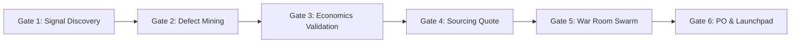

# APRS V6 Pro — Autonomous E-Commerce Product Intelligence & Swarm Platform

> **APRS V6 Pro** is an autonomous multi-agent e-commerce intelligence system designed for discovering, validating, stress-testing, and sourcing high-margin winning products across **India, USA, UK/Europe, and GCC** marketplaces.

---

## 🌟 Key Highlights in V6 Pro

- **🧠 Active AI Supervisor**: Real-time supervision, data quality validation, automatic anomaly soft-deletion with written rejection rationales, and runtime learning adjustments.
- **🤖 5-Agent Swarm + Supreme Arbiter**: Parallel multi-agent assessment with specialized roles:
  1. *Trend Scout (Nemotron-30B)*
  2. *Marketplace Analyst (Nemotron-120B)*
  3. *Defect & Quality Engineer (Nemotron-120B)*
  4. *Sourcing & Supply Chain Hunter (Nemotron-30B)*
  5. *15-Factor Unit Economics Arbiter (Nemotron-120B)*
- **📊 Comprehensive 15-Factor Economics Engine**: Full landed COGS, mold tooling amortization, payment gateway fees, RTO/return reserves, GST/VAT, transit inventory carrying costs, and 3-scenario Monte Carlo simulations (*Conservative*, *Expected*, *Upside*).
- **🌐 Universal Data-Driven Scraper**: Multi-platform scraping (`Amazon`, `Flipkart`, `Meesho`, `Myntra`, `Shopify`, `Jina Reader`) using `curl_cffi` TLS fingerprint impersonation.
- **🔍 Self-Expanding Search Discovery**: Autonomous discovery of new niche categories, viral product sources, and high-intent seed keywords without hardcoded limits.
- **🖥️ 9-Tab Streamlit Control Tower**: Live product gate tracking, RFQ launchpad, War Room AI chat with Word export, Keepa price analytics, supplier clusters, SSOT DB inspector, and AI-rejected archive.

---

## 🏗️ Architecture & Directory Tree

```
D:/ecomm-strategy/ (APRS)
├── main.py                             # CLI entrypoint (--web | --overnight | --scan)
├── .env                                # API Keys (NIM, Keepa) — strictly gitignored
├── .env.example                        # Configuration template
├── requirements.txt                    # Python dependencies
├── pytest.ini                          # Test runner configuration
│
├── config/
│   └── settings.py                     # Regional parameters, active NIM model IDs, fees & tax rates
│
├── core/
│   ├── database.py                     # SQLite SSOT (WAL mode, 16+ tables, gate state machine)
│   ├── orchestrator.py                 # 6-Stage gate orchestrator with Keepa & AI Supervisor
│   ├── economics_engine.py             # 15-Factor unit economics & scenario projection engine
│   ├── product_matcher.py              # Canonical deduplication & Demand Proxy Scoring
│   ├── background_daemon.py            # 24/7 background worker with multi-region niche rotation
│   ├── team_meeting.py                 # AI War Room: 6-specialist debate system
│   ├── excel_manager.py                # Atomic 4-sheet master Excel shadow export
│   ├── meeting_doc_manager.py          # Word (.docx) executive meeting minutes generator
│   └── utils.py                        # Regional normalization & currency formatters
│
├── models/
│   ├── nim_cluster.py                  # 3-key failover cluster, LRU cache & Pydantic arbiter
│   ├── nim_swarm_orchestrator.py       # 5-stage parallel swarm audit with negative finding bus
│   └── llm_router.py                   # Multi-provider router with fallback strategy
│
├── tools/
│   ├── ai_supervisor.py                # Central task supervisor, scraper validation & auto-pruning
│   ├── discovery_engine.py             # Autonomous open-web source, niche & keyword discovery
│   ├── universal_browser_scraper.py    # Universal multi-marketplace scraper
│   ├── amazon_live_scraper.py          # Anti-bot Amazon live scraper (curl_cffi chrome124)
│   ├── keepa_api_client.py             # Keepa API client for BSR rank & historical price signals
│   ├── review_reddit_defect_harvester.py # 3-star Amazon defect extractor & Reddit discussions
│   ├── google_trends_engine.py         # Google Trends interest & velocity tracker
│   └── trend_scout/
│       └── trend_aggregator.py         # OpenWeb trend sensor & social breakout harvester
│
├── web/
│   └── app.py                          # Streamlit UI (9 tabs, NIM manager, live DB explorer)
│
└── tests/                              # 37 Automated unit, swarm & E2E tests
    ├── test_phase1_database.py         # SQLite WAL mode, migrations & schema integrity
    ├── test_phase2_orchestrator.py     # 6-gate orchestrator & Keepa signal tests
    ├── test_phase3_scrapers.py         # Amazon scraper & Keepa client unit tests
    ├── test_phase4_nim.py              # NIM cluster failover & LRU cache tests
    ├── test_aprs_platform.py           # Core platform economics & integration tests
    ├── test_aprs_v6_swarm.py           # 5-agent swarm, negative findings & dedup tests
    ├── test_aprs_v6_advanced.py        # 15-factor economics & multi-platform listings
    └── test_phase6_e2e.py              # End-to-end full pipeline verification
```

---

## 🚦 The 6-Stage Gate Machine



| Gate | Name | Execution | Requirement / Output |
|---|---|---|---|
| **1** | **Signal Discovery** | Automated | Keepa BSR &lt; 5000 + 30-day price stability or live scraper fallback |
| **2** | **Defect Mining** | Human / AI | Amazon 3-star review defect extraction + v2.0 engineering spec |
| **3** | **Economics Validation** | Automated | 15-Factor landed COGS &gt; 15% net profit threshold under stress |
| **4** | **Sourcing Quote** | Manual / RFQ | Real factory FOB quote from domestic/international cluster |
| **5** | **War Room Consensus** | Automated | 5-agent debate + Nemotron-120B supreme consensus score |
| **6** | **PO & Launchpad** | Human | RFQ generated, sample approved, purchase order dispatch |

---

## 🤖 Active AI Models (NVIDIA NIM)

| Role | Model Identifier | Purpose |
|---|---|---|
| **Lead Arbiter & Consensus** | `nvidia/nemotron-3-super-120b-a12b` | 120B reasoning, gate decisions, adversarial debate |
| **Fast Scout & Harvester** | `nvidia/nemotron-3-nano-30b-a3b` | 30B high-throughput trend parsing & niche discovery |
| **Vision Packaging Agent** | `meta/llama-3.2-90b-vision-instruct` | Multimodal visual QC and packaging defect analysis |

---

## 🚀 Quickstart Guide

### 1. Prerequisites & Installation
```bash
# Clone the repository
git clone https://github.com/ravikamat/APRS.git
cd APRS

# Install dependencies
pip install -r requirements.txt
```

### 2. Environment Configuration
Create a `.env` file in the root directory (or use `.env.example` as a template):
```env
# NVIDIA NIM API Keys (3-Key automatic failover)
NIM_API_KEY_1=nvapi-your-primary-key
NIM_API_KEY_2=nvapi-your-secondary-key
NIM_API_KEY_3=nvapi-your-tertiary-key

# Keepa API Key (optional — falls back to live scrapers)
KEEPA_API_KEY=your-keepa-key
```

### 3. Launching APRS

```bash
# Launch Streamlit Control Dashboard + 24/7 background swarm daemon
python main.py --web

# Run standalone background discovery daemon (headless mode)
python main.py --overnight

# Execute a one-shot target niche research scan
python main.py --region India --category "Kitchen Storage" --max 5
```

---

## 🧪 Testing & Quality Assurance

All 37 test cases run against isolated temporary in-memory/file databases to preserve production state:

```bash
# Run the entire test suite
pytest tests/ -v

# Run specific suite
pytest tests/test_aprs_v6_swarm.py -v
pytest tests/test_aprs_v6_advanced.py -v
```

---

## 🌿 Git Branching Strategy

| Branch | Role | Purpose |
|---|---|---|
| **`Production`** *(Default)* | 🔒 Mainline | Stable production code and verified releases |
| **`Quality`** | 🧪 Staging | Integration testing, benchmark evaluation, and QA |
| **`dev`** | ⚡ Working | Active development, feature building, and experimentation |

---

## 🔒 Security & Privacy

- **Protected Secrets**: `.env` and all credential stores are strictly ignored by `.gitignore`.
- **Database Safety**: Local SQLite databases (`data/*.db`) and runtime logs are never tracked in Git.
- **Failover Protection**: Rate-limiting and API expiration are automatically handled across the 3-key cluster.
