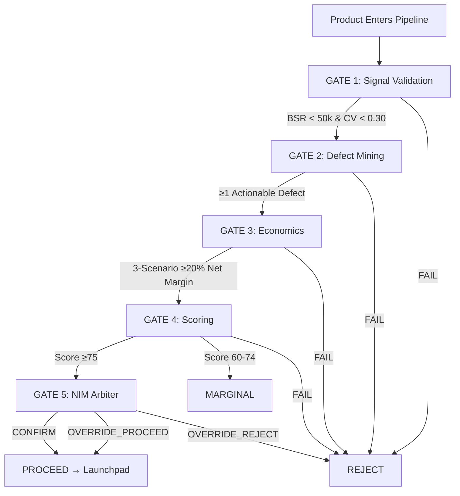

# APRS V7 Pro — Autonomous Product Research & Sourcing Platform

> **APRS V7 Pro** is a 24/7 fully autonomous multi-agent e-commerce intelligence system that discovers, validates, stress-tests, sources, and launches high-margin winning products across **India, USA, UK/Europe, and GCC** marketplaces — with zero human intervention required for research cycles.

---

## 🎯 What It Does (The Big Picture)

```
┌─────────────────────────────────────────────────────────────────────────────────┐
│                        APRS V7 AUTONOMOUS RESEARCH LOOP                          │
└─────────────────────────────────────────────────────────────────────────────────┘
                                    │
                                    ▼
┌─────────────────────────────────────────────────────────────────────────────────┐
│  1. STRATEGY PLANNER (Weekly)                                                    │
│     ├─ Analyzes market gaps, seasonality, competitive landscape                 │
│     ├─ Generates 5-10 Research Directives with priority scores                  │
│     └─ Outputs → research_directives table                                       │
└─────────────────────────────────────────────────────────────────────────────────┘
                                    │
                                    ▼
┌─────────────────────────────────────────────────────────────────────────────────┐
│  2. DISCOVERY & SIGNALS (Continuous, 2-hour cycles)                             │
│     ├─ AI SCOUT (Daily, 10× volume)                                             │
│     │   ├─ Trend Sources (120): Blogs, TikTok, Reddit, YouTube, News           │
│     │   ├─ Marketplace Sources (100): Amazon, Flipkart, Meesho, Shopify, D2C  │
│     │   ├─ Community Sources (100): Discord, FB Groups, Forums                 │
│     │   ├─ Supplier Sources (80): IndiaMART, Alibaba, 1688, TradeIndia         │
│     │   ├─ Niches (150): Micro-category expansion                              │
│     │   └─ Keywords (200): High-velocity search terms                          │
│     ├─ INTERNET CRAWLER (2hr): Scans 50+ open-web sources                      │
│     ├─ TREND SIGNAL (2hr): Google Trends, Reddit, YouTube velocity             │
│     ├─ DEMAND SENSE (Daily): Real demand proxies from marketplace data         │
│     ├─ COMPETITION X-RAY (Daily): Deep competitive analysis per category       │
│     └─ NICHE EXPANDER (Daily): Expands directives into scannable niches        │
└─────────────────────────────────────────────────────────────────────────────────┘
                                    │
                                    ▼
┌─────────────────────────────────────────────────────────────────────────────────┐
│  3. PRODUCT DISCOVERY (12-hour cycles)                                           │
│     ├─ DISCOVERY: Multi-marketplace scraping (Amazon, Flipkart, Meesho, etc.)  │
│     │   └─ Canonical deduplication → master_products                            │
│     └─ PROBLEM MINER (Daily): 3-star review defect extraction + v2.0 specs     │
└─────────────────────────────────────────────────────────────────────────────────┘
                                    │
                                    ▼
┌─────────────────────────────────────────────────────────────────────────────────┐
│  4. 5-GATE DETERMINISTIC PIPELINE (Daily)                                        │
│     GATE 1: Signal Validation     → Keepa BSR < 50k, Price CV < 0.30            │
│     GATE 2: Defect Mining         → Ollama extracts actionable defects          │
│     GATE 3: Economics Validation  → 15-Factor 3-Scenario ≥ 20% net margin      │
│     GATE 4: Deterministic Scoring → 0-100 Rubric ≥ 75 (Market 25, Review 20,   │
│                                    Margin 40, Defect 10, Competition 5)         │
│     GATE 5: NIM Arbiter Review    → Nemotron-550B overrides with reasoning     │
│     Output: product_gate_progress, gate_logs, arbiter_decision_log             │
└─────────────────────────────────────────────────────────────────────────────────┘
                                    │
                                    ▼
┌─────────────────────────────────────────────────────────────────────────────────┐
│  5. SOURCING & OUTREACH (Daily)                                                  │
│     ├─ SUPPLIER AGENT: IndiaMART/Alibaba search + GST verification              │
│     ├─ OUTREACH ENGINE: NIM 550B generates Email/WhatsApp drafts               │
│     └─ LAUNCHPAD KANBAN: Sourcing → Sample → QC → PO → Shipped → LIVE          │
└─────────────────────────────────────────────────────────────────────────────────┘
                                    │
                                    ▼
┌─────────────────────────────────────────────────────────────────────────────────┐
│  6. LEARNING & OPTIMIZATION                                                      │
│     ├─ WINNER SCORE (Daily): Leaderboard ranking all products                   │
│     ├─ MAINTENANCE (Daily): TTL cleanup, VACUUM, backup                         │
│     ├─ WEIGHT TUNER (Quarterly): Bayesian optimization of scoring weights      │
│     └─ LEARNING AGENT (Weekly): Rule synthesis from outcomes → learned_rules   │
└─────────────────────────────────────────────────────────────────────────────────┘
```

---

## 🏗️ System Architecture

```
┌────────────────────────────────────────────────────────────────────────────────────┐
│                              APRS V7 PRO ARCHITECTURE                                 │
├────────────────────────────────────────────────────────────────────────────────────┤
│                                                                                     │
│  ┌─────────────────┐    ┌──────────────────┐    ┌──────────────────────────────┐   │
│  │   CONTROL PLANE │    │  ORCHESTRATION   │    │      DATA PLANE (SQLite)     │   │
│  ├─────────────────┤    ├──────────────────┤    ├──────────────────────────────┤   │
│  │                 │    │                  │    │  39 Tables, WAL Mode, FKs    │   │
│  │  Streamlit UI   │◄───│ AgentOrchestrator│───►│  ┌────────────────────────┐  │   │
│  │  (11 Tabs)      │    │  - Scheduling    │    │  │ master_products        │  │   │
│  │  - Opportunities│    │  - Dependencies  │    │  │ product_gate_progress  │  │   │
│  │  - Agent Cmd    │    │  - Contracts     │    │  │ discovered_sources     │  │   │
│  │  - Suppliers    │    │  - Retry/Timeout │    │  │ dynamic_niches         │  │   │
│  │  - Reviews      │    │  - DB Lock Mgmt  │    │  │ trend_signals          │  │   │
│  │  - Launchpad    │    │                  │    │  │ supplier_profiles      │  │   │
│  │  - War Room     │    │  DaemonService   │    │  │ outreach_drafts        │  │   │
│  │  - Keepa        │    │  (24/7 Thread)   │    │  │ economics_assessments  │  │   │
│  │  - Economics    │    │  - Pause/Resume  │    │  │ defect_clusters        │  │   │
│  │  - DB Explorer  │    │  - Force Cycle   │    │  │ learned_rules          │  │   │
│  │  - Archive      │    │  - On-Demand     │    │  │ winner_scores          │  │   │
│  │  - Flow Graph   │    │                  │    │  │ ... + 20 more          │  │   │
│  └────────┬────────┘    └────────┬─────────┘    │  └────────────────────────┘  │   │
│           │                      │              └──────────────┬────────────────┘   │
│           │                      │                             │                    │
│           ▼                      ▼                             ▼                    │
│  ┌─────────────────────────────────────────────────────────────────────────────┐   │
│  │                        LLM ROUTER (5-Tier Fallback)                          │   │
│  │  ┌─────────────┐  ┌─────────────┐  ┌─────────────┐  ┌─────────────────┐     │   │
│  │  │ TIER 1: NIM │──│ TIER 2:     │──│ TIER 3:     │──│ TIER 4: Kimi    │     │   │
│  │  │ Nemotron    │  │ Ollama      │  │ Groq        │  │ K3 (Batch)      │     │   │
│  │  │ 550B        │  │ llama3.1:8b │  │ Llama-3.3   │  │ Moonshot        │     │   │
│  │  │ Primary     │  │ Local       │  │ Free API    │  │                 │     │   │
│  │  └─────────────┘  └─────────────┘  └─────────────┘  └─────────────────┘     │   │
│  │        │                │                │                │                   │   │
│  │        └────────────────┴────────────────┴────────────────┘                   │   │
│  │                              │                                                 │   │
│  │                              ▼                                                 │   │
│  │  ┌─────────────────────────────────────────────────────────────────────────┐  │   │
│  │  │ TIER 5: Human Override (pending_human_decisions table)                 │  │   │
│  │  └─────────────────────────────────────────────────────────────────────────┘  │   │
│  └─────────────────────────────────────────────────────────────────────────────┘   │
│                                                                                     │
└────────────────────────────────────────────────────────────────────────────────────┘
```

---

## 🤖 Agent Registry (15 Agents)

| # | Agent | Schedule | Dependencies | Output Tables | Purpose |
|---|-------|----------|--------------|---------------|---------|
| 1 | **strategy_planner** | Weekly | — | `research_directives` | Weekly strategic planning, market gap analysis |
| 2 | **ai_scout** | Daily | strategy_planner | `discovered_sources`, `dynamic_niches`, `dynamic_seed_keywords` | 10× autonomous source/niche/keyword discovery |
| 3 | **internet_crawler** | 2hr | strategy_planner | `discovered_sources`, `trend_signals` | 50+ open-web source crawling |
| 4 | **trend_signal** | 2hr | internet_crawler | `trend_signals` | Google Trends, Reddit, YouTube aggregation |
| 5 | **demand_sense** | Daily | trend_signal | `trend_signals` | Real demand proxies from marketplace data |
| 6 | **competition_xray** | Daily | demand_sense | `trend_signals` | Deep competitive analysis per category |
| 7 | **niche_expander** | Daily | competition_xray | `dynamic_niches` | Expands directives into scannable niches |
| 8 | **discovery** | 12hr | niche_expander | `master_products`, `scraped_listings`, `multi_platform_listings` | Multi-marketplace product scraping |
| 9 | **problem_miner** | Daily | discovery | `defect_clusters`, `problem_opportunities` | 3-star review defect mining + v2.0 specs |
| 10 | **gate_engine** | Daily | problem_miner | `product_gate_progress`, `gate_logs`, `arbiter_decision_log` | 5-gate deterministic pipeline |
| 11 | **supplier_agent** | Daily | gate_engine | `supplier_profiles` | IndiaMART/Alibaba search + GST verification |
| 12 | **outreach_engine** | 12hr | supplier_agent | `outreach_drafts`, `supplier_conversations` | NIM 550B Email/WhatsApp draft generation |
| 13 | **winner_score** | Daily | outreach_engine | `winner_scores` | Nightly leaderboard computation |
| 14 | **maintenance** | Daily | winner_score | (DB maintenance) | TTL cleanup, VACUUM, backup |
| 15 | **weight_tuner** | Quarterly | maintenance | `learned_rules` | Bayesian scoring weight optimization |
| 16 | **learning_agent** | Weekly | weight_tuner | `learned_rules` | Rule synthesis from outcomes |

---

## 🗄️ Database Schema (39 Tables, SQLite WAL Mode)

### Core Product Tables
| Table | Purpose | Key Columns |
|-------|---------|-------------|
| `master_products` | Single Source of Truth | `product_id`, `name`, `category`, `region`, `planned_msrp`, `landed_cogs`, `gross_margin_pct`, `net_profit_pct`, `overall_score`, `status`, `is_shortlisted`, `is_deleted`, `ai_rejection_*` |
| `product_gate_progress` | 5-Gate State Machine | `product_id`, `gate_number` (1-5), `status` (PENDING/PASS/FAIL/BLOCKED/OVERRIDDEN), `blocked_reason`, `completed_at` |
| `product_suppliers` | Supplier quotes per product | `product_id`, `factory_name`, `fob_unit_price`, `moq_units`, `certifications` |

### Discovery & Signals
| Table | Purpose |
|-------|---------|
| `discovered_sources` | AI-discovered websites/platforms with reliability scores |
| `dynamic_niches` | Auto-expanded niches replacing hardcoded lists |
| `dynamic_seed_keywords` | Auto-generated search keywords with velocity scores |
| `trend_signals` | Google Trends, Reddit, YouTube, TikTok, Instagram signals |
| `marketplace_config` | Universal scraper configs for any marketplace |
| `scraped_listings` | Raw listings from all marketplaces |
| `multi_platform_listings` | Cross-platform price/competitor comparison |

### Gate & Economics
| Table | Purpose |
|-------|---------|
| `gate_logs` | Audit trail for 4-gate pipeline |
| `arbiter_decision_log` | NIM 550B Gate 5 decisions with reasoning |
| `economics_assessments` | 15-Factor 3-Scenario results per product |
| `product_gate_progress` | Gate state machine (1-5) |

### Sourcing & Outreach
| Table | Purpose |
|-------|---------|
| `supplier_profiles` | Verified suppliers with GST, badges, scores |
| `outreach_drafts` | NIM-generated Email/WhatsApp drafts |
| `supplier_conversations` | Email/WhatsApp thread history |
| `launchpad_items` | Kanban pipeline: Sourcing → Sample → QC → PO → Live |
| `launchpad_outcomes` | Post-launch performance tracking |

### Intelligence & Learning
| Table | Purpose |
|-------|---------|
| `defect_clusters` | Structured complaint clusters from reviews |
| `problem_opportunities` | Unmet needs from Q&A, Reddit, YouTube |
| `learned_rules` | Persistent rules from Learning Agent |
| `winner_scores` | Computed leaderboard rankings |
| `agent_health` | Per-agent contract validation history |
| `agent_contracts` | Output contracts per agent |
| `swarm_audit_log` | Full agent action audit trail |
| `negative_findings` | Formal backtracking events |

### Maintenance
| Table | Purpose |
|-------|---------|
| `daily_snapshots` | Historical price/BSR/velocity |
| `review_snapshots` | 3-star review storage |
| `url_validation_log` | Product URL accessibility checks |
| `website_capture_stats` | Per-site capture/validation rates |
| `pending_human_decisions` | Human-in-the-loop escalation queue |
| `llm_tier_log` | Which LLM tier used per call |

---

## 🚦 5-Gate Deterministic Pipeline



| Gate | Name | Method | Pass Criteria | Output |
|------|------|--------|---------------|--------|
| **1** | Signal Validation | Deterministic | BSR < 50k, Price CV < 0.30 | `gate_logs`, `product_gate_progress` |
| **2** | Defect Mining | Ollama (Local) | ≥1 actionable defect + v2.0 fix | `defect_clusters`, `gate_logs` |
| **3** | Economics Validation | Deterministic 15-Factor | Expected Net Margin ≥ 20% | `economics_assessments`, `gate_logs` |
| **4** | Deterministic Scoring | Deterministic Rubric | Total Score ≥ 75 | `gate_logs` |
| **5** | NIM Arbiter | Nemotron-550B | CONFIRM/OVERRIDE_PROCEED | `arbiter_decision_log` |

---

## 🌐 LLM Router — 5-Tier Automatic Fallback

```python
# All agents call this single entry point
response = await LLMRouter().chat(
    messages=[...],
    agent_name="gate_engine",
    task_type=LLMTaskType.GATE5_ARBITER,
    json_mode=True,
    max_tokens=1500,
    temperature=0.1  # Optional override
)
```

| Tier | Provider | Model | Use Case | Availability |
|------|----------|-------|----------|--------------|
| **1** | NVIDIA NIM | Nemotron-3-Ultra-550B | Supreme Arbiter, Deep Reasoning, War Room | Primary (API key required) |
| **2** | Ollama | llama3.1:8b (local) | Defect Mining, Routine Analysis | Always (auto-starts, auto-pulls) |
| **3** | Groq | Llama-3.3-70B | Fast fallback, high throughput | Free tier (14k req/day) |
| **4** | Moonshot | Kimi-K3 | Batch tasks, long context | Optional |
| **5** | Human | `pending_human_decisions` | Escalation when all LLMs fail | Guaranteed |

**Key Features:**
- Automatic health monitoring (3 errors → tier disabled)
- Per-agent tier override via settings
- JSON mode enforcement for structured outputs
- Latency/token tracking in `llm_tier_log`

---

## 🖥️ Control Dashboard (11 Tabs)

| Tab | Icon | Key Features |
|-----|------|--------------|
| **Opportunities** | 📋 | Product pipeline, gate status, manual gate controls, shortlist/delete |
| **Agent Command** | ⚡ | 15-agent grid, mode selectors (auto/manual/disabled/force_tier), Supervisor chat |
| **Suppliers** | 🏭 | Supplier cards, GST badges, outreach drafts (approve/edit/reject/hold) |
| **Reviews** | 🔍 | 3-star defect clusters, v2.0 specs, problem opportunities |
| **Launchpad** | 🚀 | Kanban: Sourcing → Sample → QC → PO → Shipped → LIVE |
| **War Room** | 🎙️ | 6 AI specialists + Secretary, Word export |
| **Keepa** | 📈 | BSR/Price charts, cross-marketplace comparison |
| **Economics** | 📊 | 15-Factor waterfall charts, 3-scenario breakdown, quick calculator |
| **DB Explorer** | 🗄️ | All 39 tables, live search, CSV export, AI-rejected view |
| **Archive** | 🗃️ | Soft-deleted products, 1-click restore, permanent delete |
| **Flow Graph** | 🔄 | **NEW**: Interactive pipeline visualization, clickable branch details |

### Flow Graph Tab (NEW)
- **5 Visual Layers**: Planning → Discovery → Products → Gates → Outreach
- **Color-Coded Nodes**: 🟢 Completed, 🔵 Running, 🔴 Failed, 🟡 Blocked, ⚪ Idle
- **Click Any Node** → Expands detail panel with:
  - Real-time metrics (runs, successes, items created, last error)
  - **Collected Data**: Trend signals, products, gate progress, defects, suppliers, outreach drafts, learned rules, niches, sources

---

## 🚀 Quickstart

### 1. Install Dependencies
```bash
git clone https://github.com/your-repo/aprs-v7.git
cd aprs-v7
pip install -r requirements.txt

# Install Ollama (for local LLM fallback)
# Windows: winget install Ollama.Ollama
# Mac: brew install ollama
# Linux: curl -fsSL https://ollama.com/install.sh | sh
```

### 2. Configure Environment
```bash
cp .env.example .env
# Edit .env with your keys:
```
```env
# NVIDIA NIM (3-key automatic failover)
NIM_API_KEY_1=nvapi-xxxxx
NIM_API_KEY_2=nvapi-xxxxx
NIM_API_KEY_3=nvapi-xxxxx

# Optional: Keepa API for BSR/Price history
KEEPA_API_KEY=your-keepa-key

# Optional: Groq Free API (14k req/day)
GROQ_API_KEY=gsk_xxxxx
```

### 3. Run Modes

#### A. Full 24/7 Autonomous Daemon (Recommended for Production)
```bash
# Run continuous cycles every hour for 18 hours
python run_18hr_daemon.py --hours 18 --interval 3600

# Run with custom cycle limit
python run_18hr_daemon.py --max-cycles 20 --interval 1800

# Single test cycle (1 min interval)
python run_18hr_daemon.py --single --interval 60
```

#### B. Streamlit Control Dashboard (Interactive)
```bash
streamlit run web/app.py
# Opens at http://localhost:8501
```

#### C. CLI One-Shot Research
```bash
# Quick niche scan
python -c "
import asyncio
from core.agent_orchestrator import AgentOrchestrator, OrchestratorMode
orch = AgentOrchestrator(mode=OrchestratorMode.SINGLE_CYCLE)
results = asyncio.run(orch.run_cycle())
for r in results:
    print(f'{r.agent_name}: {r.state.value} ({r.items_created} created)')
"
```

---

## 📊 Monitoring & Operations

### Real-Time Logs
```bash
# Daemon log file (auto-created)
tail -f logs/daemon_YYYYMMDD_HHMMSS.log
```

### Key Metrics to Watch
| Metric | Healthy Range | Alert If |
|--------|---------------|----------|
| Cycle completion time | < 300s | > 600s |
| Agent failure rate | < 10% | > 25% |
| Database locked errors | 0 | > 5/cycle |
| Items created/cycle | > 50 | < 10 |
| DB size growth | Steady | Sudden spike |

### Database Health
```bash
# Quick table counts
python -c "
from core.database import get_live_table_counts
counts = get_live_table_counts()
for t, c in sorted(counts.items()):
    if c: print(f'{t}: {c:,}')
print(f'Total: {sum(counts.values()):,}')
"
```

### Common Operations
```bash
# Reset a product's gates for re-evaluation
python -c "
from core.database import reset_product_gates
reset_product_gates('PRODUCT_ID_HERE')
print('Gates reset')
"

# Force single agent run
python -c "
import asyncio
from core.daemon_service import daemon_controller
result = asyncio.run(daemon_controller.orchestrator.run_agent('discovery'))
print(result)
"
```

---

## 🔧 Configuration (config/settings.py)

```python
# Gate Thresholds
gate1_bsr_threshold = 50000      # Gate 1: BSR must be < this
gate1_cv_threshold = 0.30        # Gate 1: Price CV must be < this
gate3_min_margin_pct = 20.0      # Gate 3: Min net margin %
gate4_min_score = 75             # Gate 4: Min score 0-100

# Scraping Limits
batch_niche_limit = 10           # Niches per discovery run
batch_max_candidates = 50        # Products per niche
batch_max_pages = 3              # Pages per marketplace search

# Economics (India defaults)
marketplace_commission_pct = 18.0
fulfillment_fee_inr = 25.0
payment_gateway_fee_pct = 2.0
rto_rate_pct = 8.0
return_fraud_rate_pct = 2.0
ad_tacos_pct = 12.0
gst_rate_pct = 18.0

# LLM Router
nim_model = "nvidia/nemotron-3-ultra-550b-a55b"
ollama_model = "llama3.1:8b"
groq_model = "llama-3.3-70b-versatile"
ollama_temperature = 0.1
nim_temperature = 0.1
```

---

## 🛠️ Troubleshooting

| Issue | Solution |
|-------|----------|
| **Database locked** | Auto-retries with exponential backoff (3×). Check for other processes. |
| **FK constraint failed** | Product deleted mid-cycle. Gate Engine now verifies existence first. |
| **LLM all tiers failed** | Check NIM_API_KEY, Ollama running, GROQ_API_KEY. Falls back to human queue. |
| **Ollama model not found** | Auto-pulls `llama3.1:8b` on first use (2-3 min). |
| **Gate Engine 0 items** | No products at gates 1-4. Run discovery first. |
| **Contract validation failed** | Agent didn't write expected rows. Check `agent_health` table. |

---

## 📁 Project Structure (V7)

```
D:/ecomm-strategy/
├── run_18hr_daemon.py          # ← MAIN ENTRY: 18-hr continuous runner
├── main.py                      # Legacy CLI (--web, --overnight)
├── requirements.txt
├── .env.example
├── pytest.ini
│
├── config/
│   └── settings.py              # All thresholds, models, fees, regional params
│
├── core/
│   ├── agent_orchestrator.py    # 15-agent scheduler, contracts, retries
│   ├── database.py              # SQLite SSOT (39 tables, WAL, FKs)
│   ├── contracts.py             # Output validation, retry, escalation
│   ├── gate_engine.py           # 5-gate deterministic pipeline
│   ├── economics_engine.py      # 15-Factor 3-Scenario engine
│   ├── llm_router.py            # 5-tier LLM fallback router
│   ├── ollama_manager.py        # Auto-start/pull Ollama
│   ├── daemon_service.py        # 24/7 background thread + UI bridge
│   ├── validation.py            # CanonicalProduct, RawProduct, Matcher
│   ├── scoring_engine.py        # 0-100 deterministic rubric
│   ├── rule_engine.py           # Learned rule evaluation
│   ├── learning_engine.py       # Weekly rule synthesis
│   ├── winner_score.py          # Leaderboard computation
│   ├── maintenance.py           # TTL, VACUUM, backup
│   ├── weight_tuner.py          # Bayesian weight optimization
│   ├── outreach_engine.py       # Email/WhatsApp draft management
│   └── pipeline.py              # Batch pipeline orchestration
│
├── agents/
│   ├── ai_scout.py              # 10× daily source/niche/keyword discovery
│   ├── strategy_planner.py      # Weekly research directives
│   └── supervisor_ai.py         # Natural language → dispatch planner
│
├── tools/
│   ├── internet_crawler.py      # 50+ open-web source crawling
│   ├── discovery_engine.py      # Multi-marketplace scraping
│   ├── trend_scout/trend_aggregator.py  # Google Trends, Reddit, YouTube
│   ├── demand_sense.py          # Real demand proxies
│   ├── competition_xray.py      # Competitive analysis
│   ├── niche_expander.py        # Niche expansion from signals
│   ├── problem_miner.py         # 3-star review defect mining
│   ├── review_miner.py          # Ollama defect extraction
│   ├── supplier_agent.py        # IndiaMART/Alibaba + GST verify
│   ├── keepa_api_client.py      # BSR/Price history
│   └── web_agent.py             # Browser-use integration
│
├── web/
│   └── app.py                   # Streamlit 11-tab control center
│
├── logs/                        # Auto-created runtime logs
├── data/                        # SQLite databases (gitignored)
│   └── research_engine.db
│
└── tests/                       # 37 automated tests
    ├── test_phase1_database.py
    ├── test_phase2_orchestrator.py
    ├── test_phase3_scrapers.py
    ├── test_phase4_nim.py
    ├── test_aprs_platform.py
    ├── test_aprs_v6_swarm.py
    ├── test_aprs_v6_advanced.py
    └── test_phase6_e2e.py
```

---

## 🔄 Running 18-Hour Production Session

```bash
# Terminal 1: Start continuous daemon
cd D:/ecomm-strategy
python run_18hr_daemon.py --hours 18 --interval 3600

# Terminal 2 (optional): Monitor via Streamlit
streamlit run web/app.py
# → Open Flow Graph tab to watch pipeline in real-time
# → Agent Command tab to control agents manually
```

### What Happens During 18 Hours:
| Time | Activity |
|------|----------|
| T+0min | Cycle 1: Strategy Planner → AI Scout (10×) → Internet Crawler → Trend Signal |
| T+2min | Cycle 1: Demand Sense → Competition X-Ray → Niche Expander |
| T+5min | Cycle 1: Discovery → Problem Miner → Gate Engine (5 gates) |
| T+10min | Cycle 1: Supplier Agent → Outreach Engine → Winner Score |
| T+12min | Cycle 1: Maintenance → Weight Tuner → Learning Agent |
| T+12min | **Cycle 1 Complete** — DB updated, stats logged |
| T+60min | **Cycle 2 Starts** (auto) — builds on Cycle 1 data |
| ... | ... |
| T+18hr | **Final Report** — cycles, items, failures, DB growth |

### Expected Output (18 hrs, 1hr cycles):
- **~18 full cycles** × 15 agents = **270 agent executions**
- **500-2000+ new products** discovered and evaluated
- **50-200+ suppliers** found and verified
- **100-500+ outreach drafts** generated
- **20-100+ learned rules** synthesized
- **Complete audit trail** in `swarm_audit_log`, `agent_health`

---

## 🔐 Security & Privacy

- **`.env` and credentials** — Strictly `.gitignore`d
- **Local SQLite databases** (`data/*.db`) — Never committed
- **Runtime logs** (`logs/*.log`) — Never committed
- **3-Key NIM Failover** — Automatic rotation on rate-limit/error
- **Human Override Queue** — All escalations in `pending_human_decisions` table

---

## 📄 License & Credits

- **Core Logic**: Proprietary APRS V7
- **NVIDIA Nemotron-3-Ultra-550B** — Supreme Arbiter reasoning
- **Ollama + llama3.1:8b** — Local fallback
- **Groq Llama-3.3-70B** — Free tier fallback
- **Playwright / curl_cffi** — Anti-bot scraping
- **Streamlit** — Control dashboard
- **SQLite WAL** — ACID-compliant SSOT

---

## 🎯 Design Philosophy

> **"Deterministic where possible, AI where necessary, auditable everywhere."**

1. **Gates 1, 3, 4** = Pure deterministic code (no LLM)
2. **Gate 2** = Local Ollama (privacy, speed, cost)
3. **Gate 5** = NIM 550B (supreme reasoning, override power)
4. **All outputs** = Written to SQLite with contracts
5. **Every action** = Logged to `swarm_audit_log`
6. **Every failure** = Retried, then escalated to human

---

**Built for 24/7 autonomous operation. Zero manual research required.** 🚀