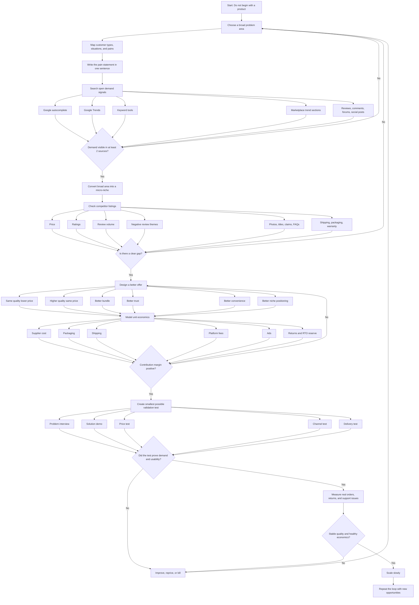

# Product Research Master Flow

## Objective
Build a deep, repeatable system to find products that can become top-selling or hot products by combining top-down discovery with bottom-up validation.

## Core idea
Do not start from a product. Start from an underserved problem, verify demand, inspect competition, model economics, and only then source or launch.

## Master principle
A winning product usually satisfies four conditions:
- Real pain.
- Visible demand.
- Better value.
- Profitable delivery.

## Full process
1. Start from a broad problem area.
2. Break it into customer groups, situations, and pains.
3. Search open demand signals.
4. Narrow to a micro-niche.
5. Audit competitor listings and reviews.
6. Identify the gap.
7. Design a better offer.
8. Check unit economics.
9. Validate with a small test.
10. Measure real order behavior.
11. Improve or kill.
12. Scale only after proof.

## Decision rules
- If the problem is weak, stop.
- If demand is weak, stop.
- If competition is too strong and no gap exists, stop.
- If margins fail after fees and returns, stop.
- If the product cannot be shown clearly in creative, stop.
- If supplier quality is inconsistent, stop.
- If the test is positive, continue and scale gradually.

## Important factors to analyze
- Customer pain intensity.
- Search demand.
- Trend stability.
- Purchase intent.
- Competition quality.
- Review complaints.
- Price bands.
- Differentiation.
- Margins.
- Shipping and packaging.
- Return risk.
- Creative potential.
- Repeat purchase potential.
- Compliance risk.
- Supplier reliability.
- Brand defensibility.

## What can make a product fail
- Wrong audience.
- Weak problem.
- No clear difference.
- Too much price competition.
- Bad listing.
- Poor photos or demo.
- High return rate.
- Weak packaging.
- Bad delivery experience.
- Margin collapse after ads and fees.
- Easy copying by competitors.

## Mermaid flowchart

## Operating checklist
- Keep one research sheet.
- Track one row per opportunity.
- Never trust a single signal.
- Always inspect recent reviews.
- Always calculate full landed cost.
- Always test before scaling.
- Always document why you killed or kept an idea.

## Research sheet columns
- Problem area.
- Customer segment.
- Situation.
- Pain statement.
- Search signals.
- Competitor links.
- Complaint patterns.
- Product concept.
- Differentiation.
- Landed cost.
- Selling price.
- Contribution margin.
- Risk notes.
- Validation result.
- Decision.

## Final rule
The correct flow is:
Problem space -> demand proof -> micro-niche -> competitor gap -> better offer -> economics -> small test -> scale.
